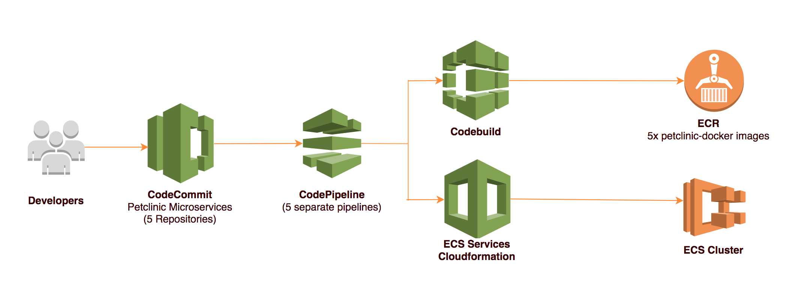
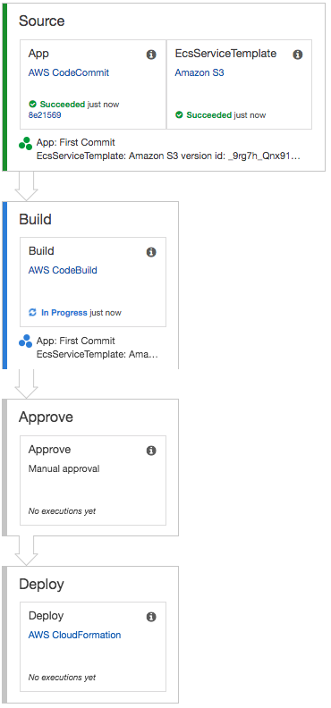
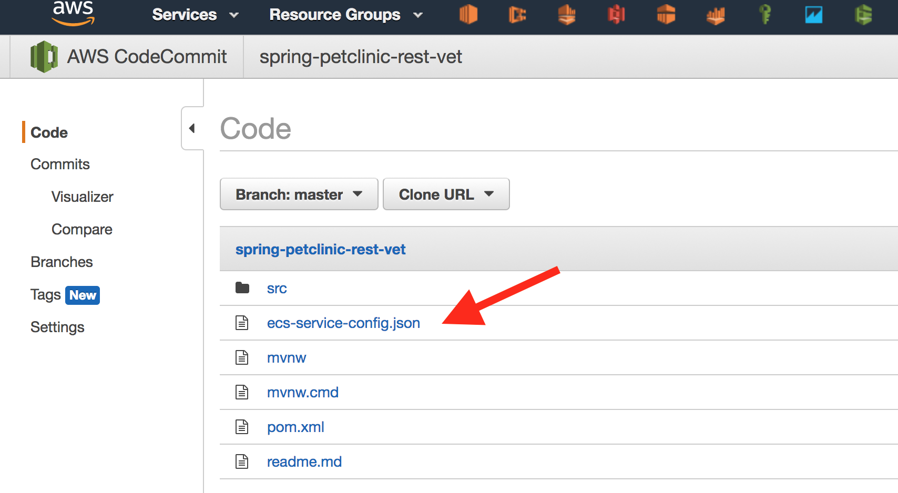
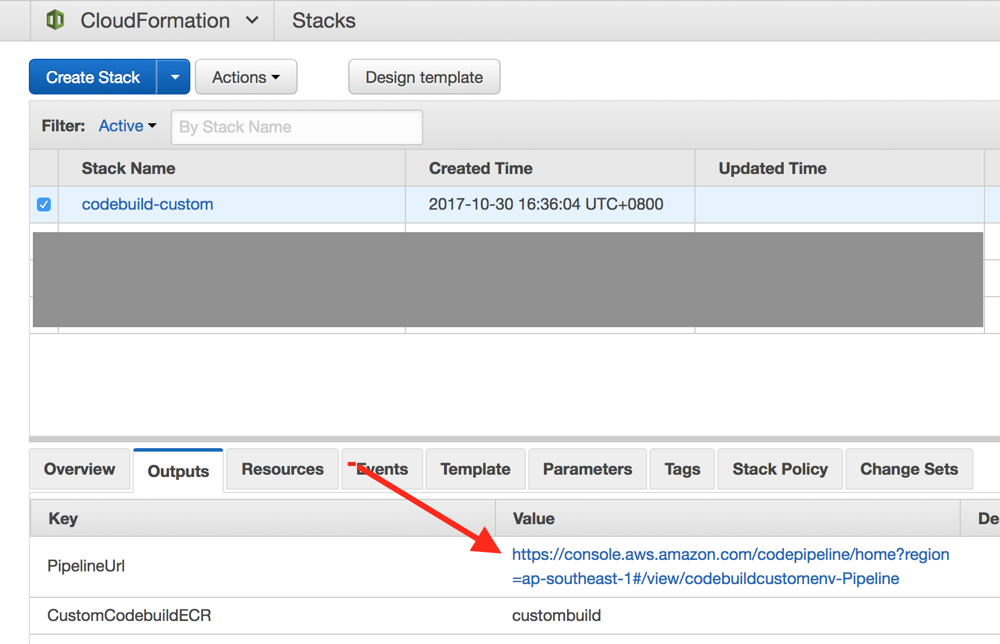
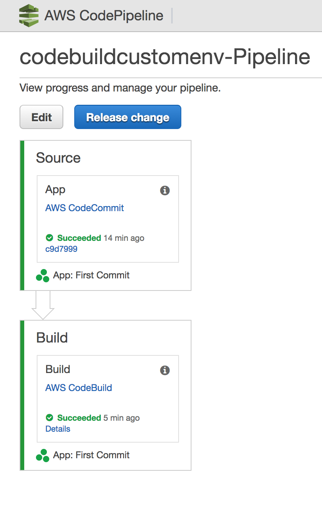
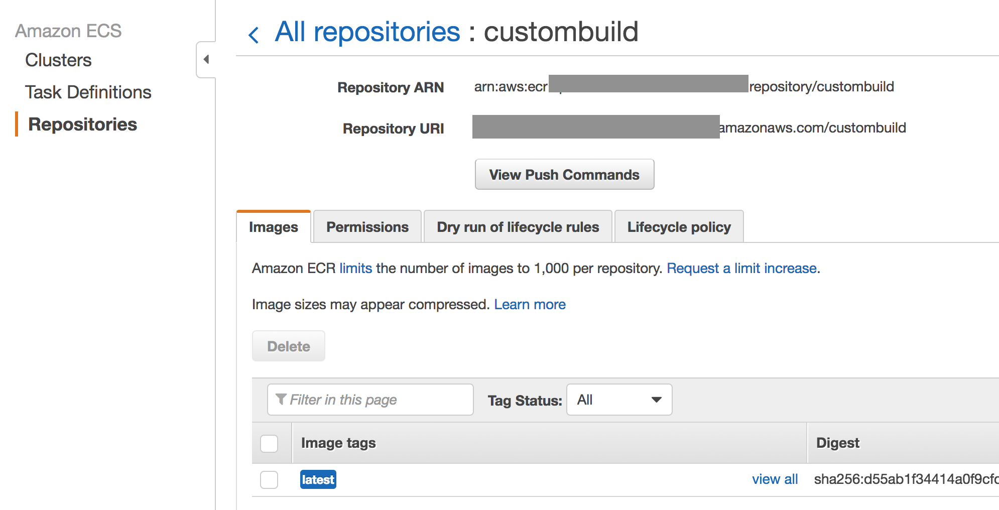
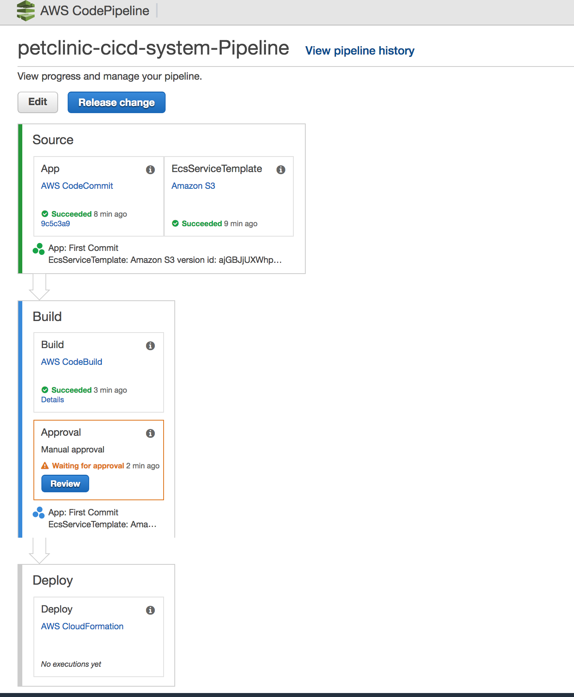
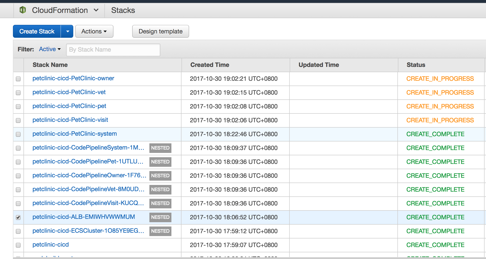
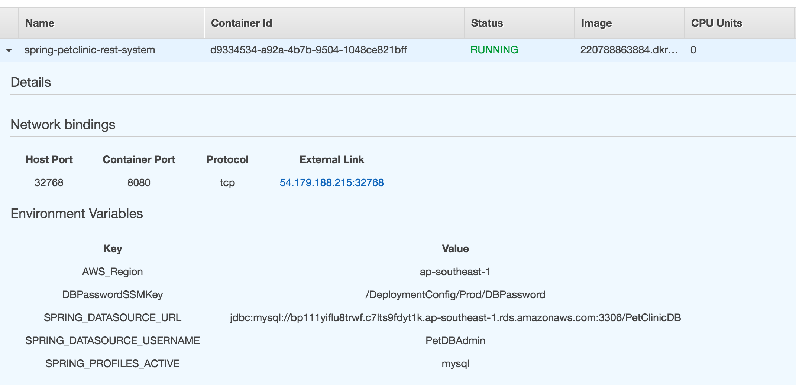
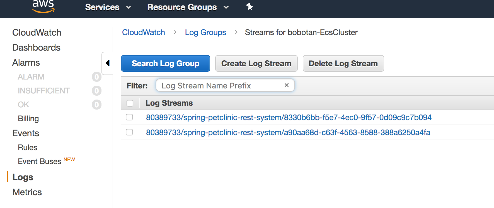

## Introduction
In this reference architecture, we will be using AWS CodeCommit, AWS CodePipeline, AWS CodeBuild to demonstrate continuous delivery of a Java Spring Boot microservices. We will be using the Spring PetClinic project found [here](https://github.com/awslabs/amazon-ecs-java-microservices/tree/master/2_ECS_Java_Spring_PetClinic_Microservices).

The continuous delivery reference architecture is shown in this diagram:


Spring PetClinic consists of 5 microservices - ```spring-petclinic-rest-owner, spring-petclinic-rest-pet, spring-petclinic-rest-system, spring-petclinic-rest-vet``` and ```spring-petclinic-rest-visit```. Each microservice has a separate AWS CodeCommit source repository.  There are also 5 AWS CodePipeline, so each microservice can be separately built and deployed onto ECS. Each microservice has its own ```Dockerfile``` to build its docker image.

To abstract the underlying infrastructure away from the developer, we use a simple JSON file which contains information on how each microservice should be deployed. Each microservice has its own ```ecs-service-config.json``` which AWS CodePipeline uses to deploy the ECS task and [service](http://docs.aws.amazon.com/AmazonECS/latest/developerguide/ecs_services.html).

For each AWS CodePipeline, there are 4 stages:
 - Petclinic Microservice Source Code and Cloudformation template for ECS Task (from AWS CodeCommit and Amazon S3 respectively)
 - Build (AWS CodeBuild)
 - Approval (Manual)
 - Deploy to ECS Cluster (AWS Cloudformation)

 

We will be using the following AWS Services in an AWS Region of your choice, please make sure the region that you select has the following AWS services:
- Amazon S3
- AWS CloudFormation
- AWS CodePipeline
- AWS CodeCommit
- AWS CodeBuild
- EC2 Container Service (ECS)
- EC2 Container Registry (ECR)
- Amazon Application Load Balancer
- Amazon EC2 Systems Manager Parameter Store


## Let's Get Started

In this step, we will download the Java Spring PetClinic Microservices from [github.com](https://github.com/awslabs/amazon-ecs-java-microservices) and upload the five Java projects into five separate AWS CodeCommit Repositories.

To do this exercise, you need a command line shell and the following tools installed:
- python 
- git
- AWS CLI (You can install this using ```pip install awscli```)
- SSH connection to AWS CodeCommit Repositories. This is to perform ```git push``` to AWS CodeCommit over SSH. You can follow the instruction [here.](http://docs.aws.amazon.com/codecommit/latest/userguide/setting-up-ssh-unixes.html
)

#### Checklist before you start
* Check that you have AWS CLI configured with an IAM user that has permission to create AWS CodeCommit repository and launch CloudFormation.
* Check that you can git push to your AWS CodeCommit repository using ssh
* Check your shell's environment variable ```AWS_DEFAULT_REGION``` is set to an AWS Region you want to deploy this project.

#### Clone the project from GitHub
To clone the project from GitHub into a temporary directory, eg:```/tmp/scratch```:

```bash

$   mkdir /tmp/scratch && cd /tmp/scratch
$   git clone https://github.com/awslabs/amazon-ecs-java-microservices

```

### Create 5 AWS CodeCommit Repositories for the microservices

To create 5 AWS CodeCommit Repositories and push 5 microservices to these repositories, run the following 2 commands. (*Note*: The second command is a single for-loop, cut & paste the command from ```for``` to ```done```.)

```bash
$   cd amazon-ecs-java-microservices/3_ECS_Java_Spring_PetClinic_CICD

$     for repo in spring-petclinic-rest-owner spring-petclinic-rest-pet spring-petclinic-rest-system spring-petclinic-rest-vet spring-petclinic-rest-visit
      do
        export gitSSHUrl=$(aws codecommit create-repository --repository-name $repo | python -c "import sys, json; print json.load(sys.stdin)['repositoryMetadata']['cloneUrlSsh']")
        cd $repo
        git init
        git add .
        git commit -am "First Commit"
        git remote add origin $gitSSHUrl
        git push --set-upstream origin master
        cd ..
     done

```
#### Verify

In the AWS Management Console, click on **Services** and navigate to **CodeCommit** under **Developer Tools**. Check that you have 5 CodeCommit Repositories (```spring-petclinic-rest-owner, spring-petclinic-rest-pet, spring-petclinic-rest-system, spring-petclinic-rest-vet``` and ```spring-petclinic-rest-visit```) for the PetClinic microservices. Navigate to each of the repository and confirm that these files are present:
- ```Dockerfile``` in ```src/main/docker/``` directory
- ```ecs-service-config.json```



You can also issue the following AWS CLI command to list the AWS CodeCommit repositories.

```bash
$   aws codecommit list-repositories |jq -r '.repositories[]|.repositoryName'

  spring-petclinic-rest-owner
  spring-petclinic-rest-pet
  spring-petclinic-rest-system
  spring-petclinic-rest-vet
  spring-petclinic-rest-visit
```

### Upload infrastructure automation CloudFormation Template to Amazon S3
AWS CloudFormation helps us setup the infrastructure like AWS CodePipeline, AWS CodeBuild, ECS Cluster with ALB and RDS. We will be using nested Cloudformation templates in this project. The ```AWS::CloudFormation::Stack``` resource type is used to create child stacks from a master stack. The CloudFormation stack requires the templates of the child stacks to be stored in the Amazon S3 bucket.
Amazon S3 is also used by AWS CodePipeline as a Source repository for the CloudFormation template that deploys each individual microservice as an ECS Service.
AWS CodePipeline expects the S3 bucket to be versioned.

#### To create a Amazon S3 bucket with versioning

To make your Amazon S3 bucket name unique, we will append it with your AWS Account ID.
You can find out your 12-digit numeric AWS Account ID using the command ```aws iam get-user```. Your Account ID is the 12-digit number under the key *Arn*.
eg:
```bash
$   aws iam get-user
{
    "User": {
        "UserName": "johndoe",
        "PasswordLastUsed": "2017-10-11T14:51:49Z",
        "CreateDate": "2017-08-24T16:35:27Z",
        "UserId": "XXXXXXXXXXXXXXXXXXXXX",
        "Path": "/",
        "Arn": "arn:aws:iam::123456789012:user/johndoe"
    }
}
```
Once you know your AWS Account ID, The following commands will create a Amazon S3 bucket in your default region and enable versioning on this bucket. 

```bash
$   export account_id=<AWS Account ID>
$   export infra_bucket_name=petclinic-infra-auto-$account_id
$   export region=$AWS_DEFAULT_REGION
$   aws s3 mb s3://$infra_bucket_name
$   aws s3api put-bucket-versioning --bucket $infra_bucket_name --versioning-configuration Status=Enabled

```

#### Upload Cloudformation templates in "infra-automation" folder to this S3 bucket
The ```aws s3 sync``` command will copy all the files in ```infra-automation``` subdirectory to your Amazon S3 bucket.
```
$   cd infra-automation
$   aws s3 sync . s3://$infra_bucket_name

```
#### Verify
Run the following command to list the objects in ```$infra_bucket_name``` bucket: 

```
$   aws s3 ls s3://$infra_bucket_name

```
You should see an output similar to this:
```bash
2017-10-30 16:27:08       1610 alb.yaml
2017-10-30 16:27:08       7520 codebuild-custom-container-ci.yaml
2017-10-30 16:27:08      13386 deployment-pipeline-codecommit.yaml
2017-10-30 16:27:08      20024 ecs-cluster-2az.yaml
2017-10-30 16:27:08       9953 master-ecs.yaml
2017-10-30 16:27:08       4650 petclinic-service.yaml
2017-10-30 16:27:08       1648 petclinic-service.zip
```

## Create Custom CodeBuild Environment
AWS CodeBuild is a fully managed build service that compiles source code, runs tests, and produces software packages that are ready to deploy. In this project, we use AWS CodeBuild to build both the Java application (using Maven) and its Docker image. The Docker image is a Java environment that launches the Spring Boot application. Once the Docker image is built, we use AWS CodeBuild to push the Docker image to EC2 Container Registry (ECR).

AWS CodeBuild provides default build environments that support different programming languages and frameworks, the build environments are Docker images which contain the tools to build and test your applications. A list of these Docker images can be found [here](http://docs.aws.amazon.com/codebuild/latest/userguide/build-env-ref-available.html). One of the image, ```aws/codebuild/docker:1.12.1``` allows AWS CodeBuild to build Docker images, but it does not contain the Java SDK and Maven tool needed to build our Java applications.

To avoid installing the Java SDK and Maven tool each time we build our project, we can create a custom build environment.
CodeBuild custom build environment is a Docker image which is pre-installed with all the dependencies for our pet-clinic microservices. These dependencies include Java SDK, Maven and AWS CLI. Another benefit of using a custom build environment is that it provides us the control over the version of the build tools and Java SDK.

To build the Docker image for our custom build environment, we are going to use a simple continuous delivery pipeline. The Dockerfile and script that define this custom container will be store in a AWS CodeCommit Repository. A CodePipeline will use this CodeCommit Repository as Source and build the container using the default ```aws/codebuild/docker:1.12.1``` image.

#### Create AWS CodeCommit Repository for the CodeBuild Custom Build Environment

```bash
$   cd ../codebuild-custom-env
$   export gitSSHUrl=$(aws codecommit create-repository --repository-name codebuildcustomenv | python -c "import sys, json; print json.load(sys.stdin)['repositoryMetadata']['cloneUrlSsh']")
$   git init
$   git add .
$   git commit -am "First Commit"
$   git remote add origin $gitSSHUrl
$   git push --set-upstream origin master
```

#### Create AWS CodeBuild Custom Environment
Using AWS CLI, launch the Codebuild Custom Environment Cloudformation template from your ```<infra-automation-bucket-name>``` bucket.

Run one of these commands depending on your AWS Region:

```bash
#if you are in US-East-1 Region
$   aws cloudformation create-stack --stack-name codebuild-custom --template-url \
https://s3.amazonaws.com/$infra_bucket_name/codebuild-custom-container-ci.yaml \
--parameters ParameterKey=CodeCommitRepo,ParameterValue="codebuildcustomenv" ParameterKey=ECRRepositoryName,ParameterValue="custombuild" \
--capabilities CAPABILITY_IAM

#if you are NOT in US-East-1 Region
$   aws cloudformation create-stack --stack-name codebuild-custom --template-url \
https://s3-$region.amazonaws.com/$infra_bucket_name/codebuild-custom-container-ci.yaml \
--parameters ParameterKey=CodeCommitRepo,ParameterValue="codebuildcustomenv" ParameterKey=ECRRepositoryName,ParameterValue="custombuild" \
--capabilities CAPABILITY_IAM

```

#### Verify
Using AWS Console, Navigate to **CloudFormation** under **Management Tool** and select the Stack *codebuild-custom*. Under the *Output* tab, click on the URL to the **CodePipeline** console.



Verify that your CodePipeline has finished the *Build* Stage:



Navigate to **EC2 Container Service** and click on *Repositories*, verify that you have the ```custombuild``` container image. Note the repository URI. eg: ```123456789012.dkr.ecr.<AWS::Region>.amazonaws.com/custombuild```, we will use this container image for AWS CodeBuild in our next step.



## Create continuous delivery pipelines for our PetClinic microservices

#### Create EC2 Parameter store for RDS Database password
Parameter Store, part of Amazon EC2 Systems Manager, provides a centralized, encrypted store to manage our RDS database connection information and password. As we cannot provision a "SecureString" Parameter using AWS CloudFormaion, we have to add our RDS database password using AWS CLI. Replace *mysqlpassword* with your own RDS password.

```bash
$   aws ssm put-parameter --name /DeploymentConfig/Prod/DBPassword --value <mysqlpassword> --type SecureString
```
The above command will encrypt our database password using KMS key ```alias/aws/ssm``` and store it in EC2 Parameter store. This is a secure way for ECS tasks (with the proper task role IAM permission to this parameter store and KMS key) to access the RDS database password. There is no need to put the database password in any configuration file.

#### Create ECS Cluster with RDS and 5 AWS CodePipelines 

Using AWS CLI, let's launch the AWS CloudFormation stack that will create the ECS Cluster, ALB, RDS and 5 AWS CodePipeline. You need to specify your EC2 SSH Key Pair Name as a parameter to this CloudFormation stack. This SSH Key let you access the EC2 instances of your ECS cluster. To find out your SSH Key Pair Name, use AWS Console and navigate to **EC2** console and click on *Key Pairs* under *Network & Security*.  If you do not have a SSH Key Pair, click on **Create Key Pair** and specify a name for the Key Pair.


```bash
  
$   export mysshkey=<EC2 SSH Key Pair Name>
```

Run one of these commands depending on your AWS Region:

```bash
#if you are in US-East-1 Region
$   aws cloudformation create-stack --stack-name petclinic-cicd --template-url \
https://s3.amazonaws.com/$infra_bucket_name/master-ecs.yaml --parameters \
ParameterKey=CodeBuildContainerSpringBootDocker,ParameterValue=$account_id.dkr.ecr.$region.amazonaws.com/custombuild:latest \
ParameterKey=InfraAutomationCfnBucket,ParameterValue=$infra_bucket_name \
ParameterKey=KeyPair,ParameterValue=$mysshkey \
ParameterKey=DBPassword,ParameterValue=$(aws ssm get-parameters --name /DeploymentConfig/Prod/DBPassword --with-decryption --query 'Parameters[0].Value') \
ParameterKey=SsmKMSKeyArn,ParameterValue=$(aws kms describe-key --key-id 'alias/aws/ssm' --query 'KeyMetadata.Arn') \
--capabilities CAPABILITY_IAM


#if you are NOT in US-East-1 Region
$   aws cloudformation create-stack --stack-name petclinic-cicd --template-url \
https://s3-$region.amazonaws.com/$infra_bucket_name/master-ecs.yaml --parameters \
ParameterKey=CodeBuildContainerSpringBootDocker,ParameterValue=$account_id.dkr.ecr.$region.amazonaws.com/custombuild:latest \
ParameterKey=InfraAutomationCfnBucket,ParameterValue=$infra_bucket_name \
ParameterKey=KeyPair,ParameterValue=$mysshkey \
ParameterKey=DBPassword,ParameterValue=$(aws ssm get-parameters --name /DeploymentConfig/Prod/DBPassword --with-decryption --query 'Parameters[0].Value') \
ParameterKey=SsmKMSKeyArn,ParameterValue=$(aws kms describe-key --key-id 'alias/aws/ssm' --query 'KeyMetadata.Arn') \
--capabilities CAPABILITY_IAM

```

#### Verify
Navigate to the AWS CloudFormation console. The ```master-ecs.yaml``` CloudFormation template will launch 7 nested stacks (5 AWS CodePipelines for the 5 microservices, 1 for ALB, 1 for ECS and RDS). Verify all the Cloudformation Stacks are completed.


Use the AWS Management Console to verify that you have:
 - ECS Cluster   (ECS Console)
 - Application Load Balancer (EC2 Console -> Load Balancer)
 - 5 AWS CodePipeline  (CodePipeline Console)
 - EC2 Parameter Store containing the 3 parameters for RDS  (EC2 Console)

 


#### Manual Approval for AWS CodePipeline
 The AWS CodePipelines are configured with *Manual Approval* step. Navigate to each CodePipeline and click on the Approval step to let CodePipeline deploy the ECS service. You can access the CodePipeline console URL from the *Output* tab of the respective CodePipeline CloudFormation Stacks.



Once you have approved all 5 CodePipelines, 5 more CloudFormation stacks will be created for the ECS Services.




### Store secret securely in EC2 Parameter Store
We had encrypted the database password in EC2 Parameter Store, only the ECS Tasks with their Task IAM role can decrypt the password. The database password does not show up as *Environment Variables* in the ECS Console. Instead, only the key (/DeploymentConfig/Prod/DBPassword) to the password in Parameter Store is shown (see diagram below).

(Navigate to *ECS Console* -> Select *petclinic-cicd-EcsCluster* Cluster -> *Tasks* Tab ->Click on any Task and expand on the *Containers* section)


#### Central logging for PetClinic microservices

You can check the Spring Boot log of each microservice using Cloudwatch log. Navigate to the Cloudwatch Log Group ```petclinic-cicd-EcsCluster``` and filter the logs using the git commit hash and microservice name. There is 1 log stream for each container. 



## Deploy a change to one of the PetClinic microservices
A benefit of microservices is that we can we scale each microservice independently. Let's suppose we want to increase the container count from 2 to 4 for the ```spring-petclinic-rest-pet``` microservice. Edit the JSON file - ```ecs-service-config.json```  for ```spring-petclinic-rest-pet```:


```bash
$   cd ../spring-petclinic-rest-pet
# edit ecs-service-config.json :change  "count": "2" to "count": "4"
# vi ecs-service-config.json. 
# Quit vi using :wq!  :-)

#commit the change
$   git commit -am "Update spring-petclinic-rest-pet microservice to 4 containers"
#push the change to trigger the update of this microservice
$   git -f push
```

Notice also how we can use this ```ecs-service-config.json``` file to set the path-base routing and routing priority of each microservice. Application Load Balancer (ALB) provides path-base routing to each of the microservices as depicted [here](https://d2908q01vomqb2.cloudfront.net/1b6453892473a467d07372d45eb05abc2031647a/2017/07/10/ecs-spring-microservice-containers.png).
This JSON file is used by AWS CodePipeline Parameter override when it performs a CloudFormation deployment of the ECS Service.

#### Verify
- Navigate to AWS CodePipeline Console and validate that AWS CodePipeline of ```spring-petclinic-rest-pet``` is triggered and a new container is built.
- Navigate to ECS Console and validate a new copy of ```spring-petclinic-rest-pet``` container in ECR
- Navigate to ECS Console and validate that the ECS Service for ```spring-petclinic-rest-pet``` is updated to 4


## Cleanup

To delete the AWS resources, perform the tasks below in order:
- Delete the 5 templates of ECS Services (CloudFormation Console)
- Delete the 5 petclinic docker images from ECR  (ECS Console)
- Delete the master stack (CloudFormation console)
 - If the ECS Cluster deletion fails, go to ECS Console to delete it
- Delete the 5 CodePipeline buckets (S3 console)
  - Cloudformation cannot delete an S3 bucket that is not empty. We will delete the bucket manually using AWS Console or AWS CLI

```
$   aws s3 rb s3://<infra-automation-bucket-name> --force
```

- Delete the snapshot of RDS (RDS console -> snapshot)
- Delete CodeCommit Repositories


```bash
$   for repo in spring-petclinic-rest-owner spring-petclinic-rest-pet spring-petclinic-rest-system spring-petclinic-rest-vet spring-petclinic-rest-visit
    do
      aws codecommit delete-repository --repository-name $repo
    done
```


## Conclusion

In this post, we demostrated how to setup a continuous delivery pipeline using AWS CodeCommit, AWS CodePipeline, AWS CodeBuild and AWS Cloudformation for Java Microservices.
